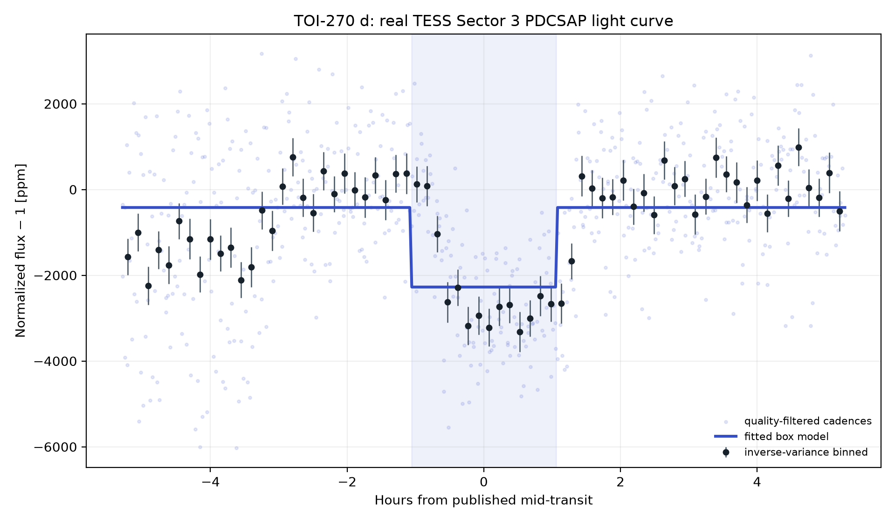
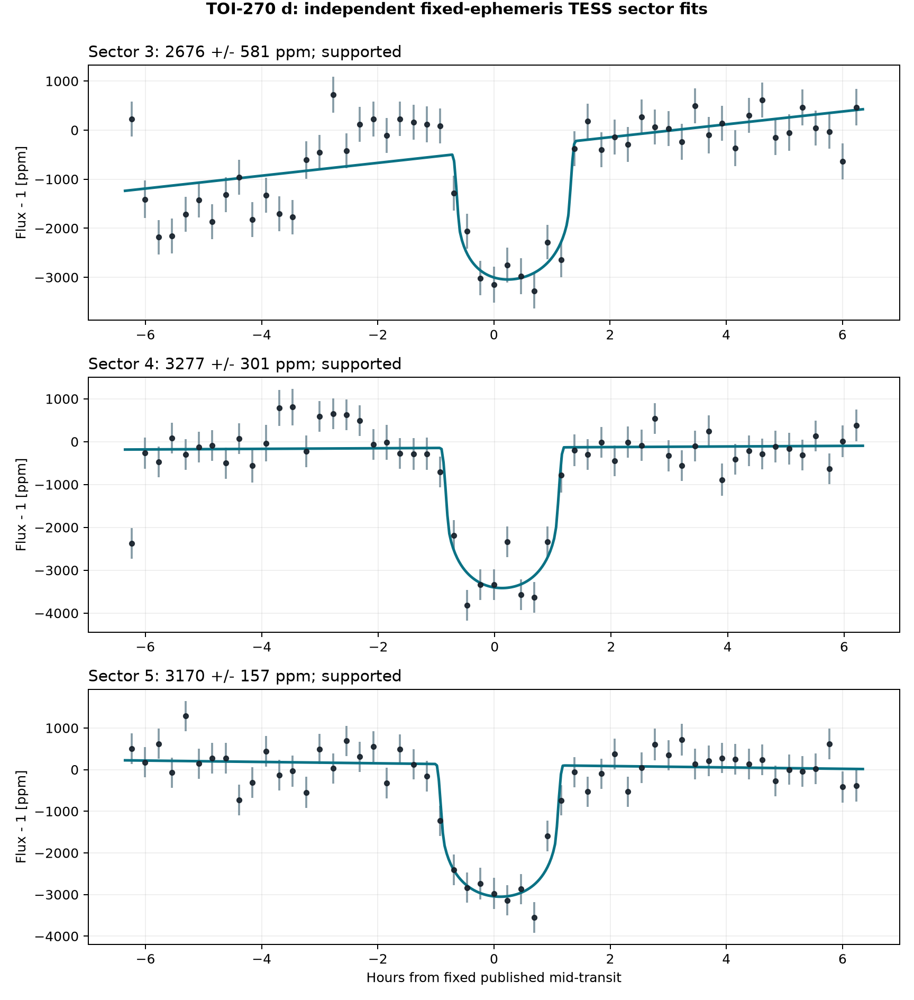
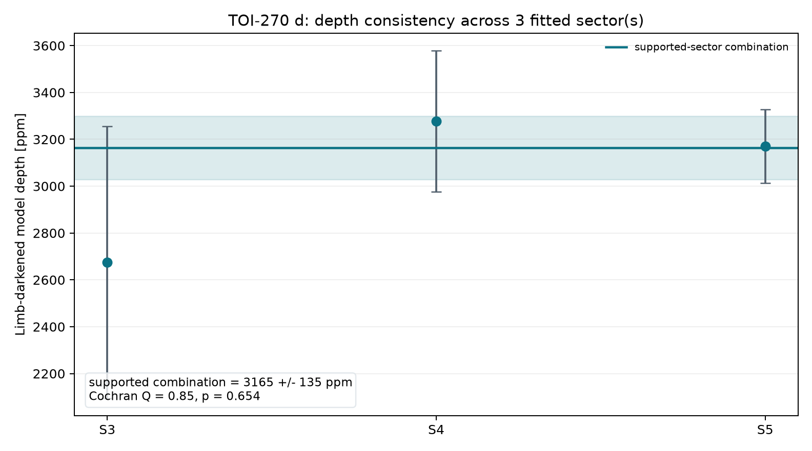
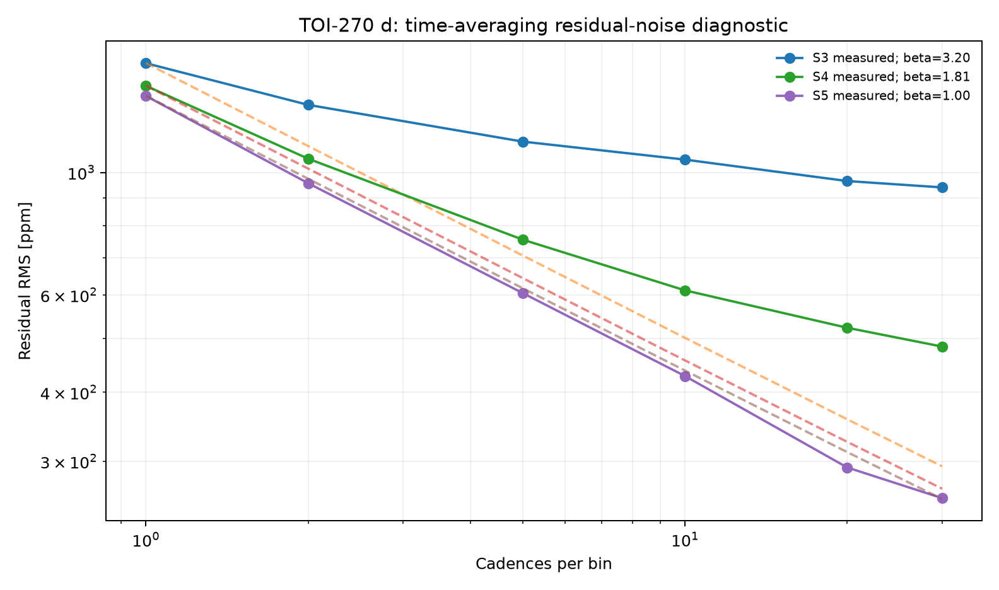
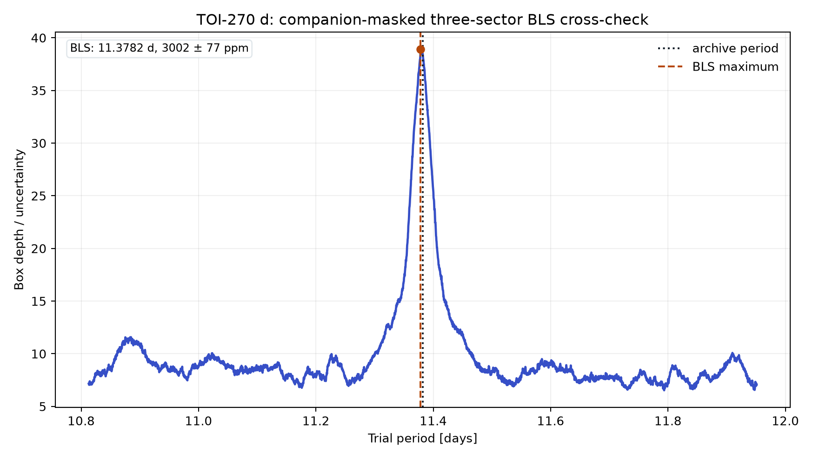

# TOI-270 d: A Temperate Sub-Neptune in a Compact System
<!-- RESEARCH-IDENTITY-START -->
**Independent research report by [Biswajit Jana](https://biswajit1999.github.io/Biswajit_Jana.github.io/)** · [Live report](https://biswajit1999.github.io/toi-270d-exoplanet-report/) · [ORCID](https://orcid.org/0009-0002-2411-1891) · [Complete research portfolio](https://biswajit1999.github.io/Biswajit_Jana.github.io/research/exoplanets/)
<!-- RESEARCH-IDENTITY-END -->


<!-- TARGET-IDENTITY-START -->
<p align="center">
  
</p>

<p align="center"><em>AI-generated artist's interpretation informed by the measured system properties; not a direct image.</em></p>

**Temperate sub-Neptune · compact system · TESS**

The outer transiting world in a compact M-dwarf system, examined here through its TESS timing, transit support, and the limits of what broadband photometry can say about atmosphere.
<!-- TARGET-IDENTITY-END -->
<p align="center">
  
</p>


**[Open the full report](https://biswajit1999.github.io/toi-270d-exoplanet-report/)** — the live GitHub Pages version.

## Data sources

- **System parameters** — the saved `pscomppars` row from the [NASA Exoplanet Archive TAP service](https://exoplanetarchive.ipac.caltech.edu/TAP/sync?query=select+pl_name%2Chostname%2Cra%2Cdec%2Cpl_orbper%2Cpl_tranmid%2Cpl_trandur%2Cpl_rade%2Cpl_bmasse%2Cpl_eqt%2Cpl_orbsmax%2Csy_dist%2Csy_tmag%2Cst_teff%2Cst_rad%2Cst_mass%2Cdisc_year%2Cdiscoverymethod%2Cdisc_refname%2Cdisc_pubdate%2Cdisc_facility+from+pscomppars+where+pl_name%3D%27TOI-270+d%27&format=csv).
- **Observed photometry** — unmodified MAST file `tess2018263035959-s0003-0000000259377017-0123-s_lc.fits`, TESS Sector 3, DOI [10.17909/t9-nmc8-f686](https://doi.org/10.17909/t9-nmc8-f686). This is a real SPOC reduced light curve, not simulated data.
- Exact URLs, IDs, retrieval date, and SHA-256 checksum are in [`data/SOURCE.md`](data/SOURCE.md).

## Reproduce the analysis

```bash
pip install -r requirements.txt
python scripts/analyze_transit.py
python scripts/analyze_multisector.py
python scripts/analyze_bls_crosscheck.py
pytest tests/ -v
```

The script keeps finite `QUALITY == 0` cadences, normalizes `PDCSAP_FLUX`, and applies one symmetric robust outlier rule. A local linear null is compared with a circular quadratic-limb-darkened transit. The archive period and predicted phase are retained, while midpoint, radius ratio, impact parameter, baseline, and baseline slope are fitted inside a bounded window. The limb-darkening coefficients and scaled semi-major axis are fixed and disclosed in the CSV.

## What the corrected fit shows

| Quantity | Result |
|---|---:|
| TESS sector | 3 |
| Cadences in fitted window | 756 |
| Transit support | **Supported — ΔBIC = 301.7 (lower-margin within this portfolio)** |
| Midpoint correction | +0.343 h ± 1.73 min |
| Model mid-transit depth | 2676.0 ± 181.6 ppm |
| Radius ratio Rp/Rs | 0.04728 |
| Fitted / published duration | 2.093 / 2.117 h |
| Linear null χ² / dof / BIC | 1384.53 / 754 / 1397.79 |
| Transit χ² / dof / BIC | 1062.97 / 751 / 1096.11 |
| ΔBIC (null − transit) | 301.68 |

The timing-adjusted transit is strongly preferred by ΔBIC = 301.7. Its fitted midpoint is +0.343 hours from the historical prediction; the model's mid-transit depth is 2676.0 ± 181.6 ppm. A fitted timing correction can diagnose ephemeris drift, but this single-sector fit is not a replacement for a global transit-timing analysis.

<!-- MULTISECTOR-UPGRADE-START -->
## Multi-sector robustness and correlated noise

The archive prediction was timing-adjusted independently in 3 fitted sector(s) (S3, S4, S5), of which 3 meet Delta BIC >= 10. Formal depth errors were inflated by sqrt(max(reduced chi-square, 1)) times the residual time-averaging beta factor (observed range 1.00-3.20). The robust inverse-variance model depth across supported sectors is 3164.7 +/- 135.2 ppm; Cochran Q = 0.85 for 2 dof (p = 0.6544). These scaled errors address underestimated scatter and short-timescale correlation, but they are not a full Gaussian-process or physical limb-darkened transit fit.

<p align="center"></p>

<p align="center"></p>

<p align="center"></p>

The per-sector table is in [`figures/multisector_statistics.csv`](figures/multisector_statistics.csv). Regenerate all three figures with `python scripts/analyze_multisector.py`.
<!-- MULTISECTOR-UPGRADE-END -->

<!-- BLS-CROSSCHECK-START -->
## Model-independent period and depth cross-check

The limb-darkened fit is checked with Astropy's `BoxLeastSquares`, which uses a box-shaped signal rather than the `batman` transit profile. Before the search, cadences around the saved NASA Exoplanet Archive transit windows of TOI-270 b and c are masked; without this step, twice planet c's 5.66-day period produces a strong alias near 11.32 days. The disclosed search is limited to ±5% around planet d's archived period, so this is a consistency test, not a blind discovery search.

| Quantity | BLS result |
|---|---:|
| Sectors / retained cadences | 3 / 42,991 |
| Companion-window cadences masked | 1,562 |
| Archive period | 11.38194 d |
| BLS maximum | 11.37824 d (−0.0325%) |
| Box depth | 3002.3 ± 77.1 ppm |
| Box depth S/N | 38.9 |

The companion-masked box depth agrees within 1.1σ with the independent-sector limb-darkened combination (3164.7 ± 135.2 ppm). The BLS period is only 0.0325% below the archive value and is not used to revise the authoritative ephemeris.

<p align="center"></p>

Machine-readable results are in [`figures/bls_crosscheck.csv`](figures/bls_crosscheck.csv), and the saved companion inputs are in [`data/companion_ephemerides.csv`](data/companion_ephemerides.csv). Regenerate them with `python scripts/analyze_bls_crosscheck.py`.
<!-- BLS-CROSSCHECK-END -->

## System context

- Radius: 2.00 Earth radii
- Mass: 4.20 Earth masses
- Orbital period: 11.381940 days
- Transit duration: 2.117 hours
- Semi-major axis: 0.0721 AU
- Equilibrium temperature: 383 K
- Host: TOI-270 · distance 22.48 pc
- Discovery: 2019 by Transit (Transiting Exoplanet Survey Satellite (TESS))

## Limitations

- The orbit is assumed circular and the quadratic limb-darkening coefficients are fixed representative values; they are not atmosphere-grid interpolations.
- This is a lower-margin supported result within this portfolio. Its support is more sensitive than the very large-ΔBIC cases to fixed analysis choices such as the outlier rule, fitting window, and limb-darkening coefficients.
- The scaled semi-major axis is derived from the saved composite semi-major axis and stellar radius; their uncertainties are not propagated.
- Midpoint freedom corrects accumulated ephemeris error but introduces a bounded timing search. ΔBIC, not a naïve one-parameter p-value, is used as the support gate.
- PDCSAP processing, dilution, stellar variability, transit-timing variations, and long-timescale covariance can still bias the inferred geometry.
- Radius ratio, impact parameter, and fixed limb darkening are correlated. Published global fits with physical priors and simultaneous detrending remain authoritative.

## Repository structure

```text
README.md
index.html
requirements.txt
data/                       unmodified TESS FITS + NASA row + SOURCE.md
scripts/analyze_transit.py  timing-adjusted limb-darkened transit fit
scripts/analyze_bls_crosscheck.py  model-independent three-sector box search
figures/                    generated plot + summary_statistics.csv
tests/                      real-data regression tests
.github/workflows/tests.yml CI on every push and pull request
LICENSE                     MIT
```

## References

1. [Günther et al. 2019](https://ui.adsabs.harvard.edu/abs/2019NatAs...3.1099G/abstract) — discovery reference as listed by the NASA Exoplanet Archive.
2. Ricker, G. R. et al. (2015), *Transiting Exoplanet Survey Satellite (TESS)*, JATIS 1, 014003, [doi:10.1117/1.JATIS.1.1.014003](https://doi.org/10.1117/1.JATIS.1.1.014003).
3. TESS Team, *TESS Light Curves — All Sectors*, MAST, [doi:10.17909/t9-nmc8-f686](https://doi.org/10.17909/t9-nmc8-f686); Sectors 3–5 used here.
4. [NASA Exoplanet Archive](https://exoplanetarchive.ipac.caltech.edu/), `pscomppars` TAP row retrieved 2026-08-15.

## Author

Biswajit Jana — [Portfolio](https://biswajit1999.github.io/Biswajit_Jana.github.io/) · [GitHub](https://github.com/Biswajit1999) · [LinkedIn](https://www.linkedin.com/in/biswajit-jana-27011a151/) · [ORCID](https://orcid.org/0009-0002-2411-1891)
